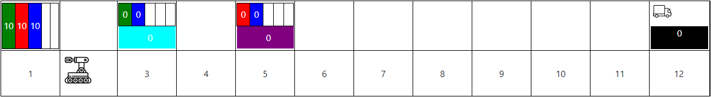

# NextTopDevOps

Greetings, DevOps Trainee! You have been recruited by the Bynet DevOps Team to develop a manufacturing line automation process.

The automation process will be executed at a remote manufacturing line based on guidance from the head office.




## Guidelines

- During operation a visual status can be viewed at [Manufacturing Line UI](https://hackathon.devops.bynet.co.il/swagger) which updates every 5 seconds.

- Operation starts after receiving a response to a recipe request from head office.
    - there are 2 recipes that should be completed ids (1,2) 

- at the end of operation submit a plan report to head office including all steps preformed.
    - allowed values for operation state: Complete, MissingMaterials, BadRecipe and Failed
    - allowed values for plan steps: MoveFwd, MoveBck, Pickup, Place and StartMachine
- failure during an operation will require restarting the operation by requesting the recipe again.

- head office provides a rest based api with specification available at [Swagger](https://hackathon-officeapi.devops.bynet.co.il/swagger)

- a sdk providing support to issue commands to the robot of a specific manufacturing line, available as (latest version 1.0.5):
    - Nuget package named RobotSDK
        ``` xml
        <?xml version="1.0" encoding="utf-8"?>
        <configuration>
            <packageSources>
                <clear />
                <add key="Hackathon" value="https://pkgs.dev.azure.com/BynetDevOpsTeam/_packaging/Hackathon/nuget/v3/index.json" />
            </packageSources>
        </configuration>
        ```
    - Maven package named il.co.bynet.bynetdevops.robotsdk:robotsdk-client
        ``` xml
        <repository>
            <id>Hackathon</id>
            <url>https://pkgs.dev.azure.com/BynetDevOpsTeam/_packaging/Hackathon/maven/v1</url>
            <releases>
                <enabled>true</enabled>
            </releases>
            <snapshots>
                <enabled>true</enabled>
            </snapshots>
        </repository>
        ```

## Operating Limitations

- Head office does not know if an order can be fulfilled.

- If robot goes outside manufacturing line bounds it will be destroyed.

- If robot fails to place or pickup material robot arm will be destroyed.

- Robot can carry one material at a time.
